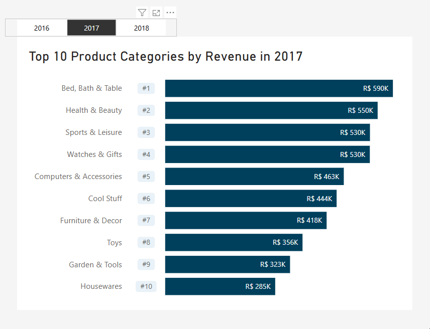

## Project Background

Olist is a leading Brazilian e-commerce platform that connects small and medium-sized businesses to customers across the country. It operates as a marketplace, enabling sellers to list their products and manage orders efficiently. Olist’s extensive database includes information on customer orders, product categories, seller performance, delivery times, and customer reviews, making it a rich source of data for analysing e-commerce trends and operational efficiency.

The goal of this project is to leverage Olist’s data to analyse two critical aspects of its business:

1. **Product Category Performance**: Identify top-selling product categories, analyse sales trends, and understand customer purchasing behaviour to uncover opportunities for growth and optimisation.
2. **Delivery Performance**: Evaluate delivery times, identify bottlenecks in the delivery process, and observe the correlation of delivery efficiency on customer satisfaction and repeat purchases.

By combining insights from both analyses, this project aims to provide actionable recommendations to optimise product offerings, improve delivery operations, and enhance the overall customer experience on Olist.

## Data Structure & Overview
Olist´s database structure consists of the following nine tables:

  
   
  <em>Figure 1: Entity Relationship Diagram showing table relationships in the dataset.</em>

  
- `customers`: This dataset includes information about the customer, such as their location and unique customer ID. The latter allows us to identify returning customers.  

- `orders`: This dataset offers insights into individual transactions, including the order status, timestamps for when an order was approved, when it was handed over to the carrier, when it was delivered to the customer, and the estimated delivery date provided at the time of purchase.

- `order_items`: This dataset includes information about the items purchased within each order, such as item price and freight value. This allows us to calculate total order and freight value.

- `order_payments`: 
This dataset includes information about the payment options for each order, such as method of payment, transaction value and number of installments chosen by the customer.

- `order_reviews`: 
This dataset includes data about customer reviews, including review score, comments and creation date. 

- `products`: 
Information about each product, such as categories, dimensions and weight.  

- `sellers`: 
This dataset contains location information about the sellers who processed orders placed on Olist.

- `geolocation`: 
Geographic data containing Brazilian postcodes, city, state and coordinates.

- `product_category_name_translation`: 
This dataset offers English translations for all product category names.

A detailed account of data inspection and cleaning can be found [here](data_cleaning.md)

## Executive Summary
This analysis examines the performance of product categories on Olist from 2016 to 2018, identifying top-selling categories and evaluating trends in consumer behaviour. Key findings include:
- **Health & Beauty** emerged as the top-performing category, rising from **#3 in 2016 to #1 in 2018**.
- **Watches & Gifts** and **Bed, Bath & Table** also showed significant growth, reflecting shifting consumer preferences.
- **Furniture & Decor**, despite being the top category in 2016, declined to **#7 in 2017 and 2018**.
- The top 10 categories accounted for **72.26% of total revenue in 2016**, **62.89% in 2017**, and **63.29% in 2018**, indicating high revenue concentration.

These insights provide a foundation for strategic decision-making, with further analysis planned to evaluate delivery performance and its impact on customer satisfaction.

## Insights Deep Dive

### Key Trends in Product Category Performance
The analysis revealed several notable trends in product category performance over the three-year period:

1. **Health & Beauty**: This category demonstrated consistent growth, climbing from **#3 in 2016 to #1 in 2018**. Its rise highlights strong consumer demand, making it a key focus for future marketing and inventory strategies.

2. **Watches & Gifts**: Improved steadily, rising from **#7 in 2016 to #2 in 2018**. This growth suggests increasing popularity and potential for further investment.

3. **Bed, Bath & Table**: Emerged as a top performer in **2017**, maintaining its position in **2018**. This reflects growing consumer interest in home-related products.

4. **Furniture & Decor**: Despite starting as the **top category in 2016**, it declined to **#7 in 2017 and 2018**. This decline may indicate shifting consumer priorities or market saturation.

  
   
  <em>Figure 2: Interactive bar chart showing top 10 product categories by year.</em>

### Revenue Insights
- The top 10 categories generated **R$40,843.55 in 2016**, **R$4,489,034.04 in 2017**, and **R$5,469,522.96 in 2018**, showing significant revenue growth despite partial data coverage for 2016 (September–December) and 2018 (January–August).
- Revenue concentration remained high, with the top 10 categories accounting for **72.26% of total revenue in 2016**, **62.89% in 2017**, and **63.29% in 2018**.

  
   
  <em>Figure 3: Ribbon chart showing rank changes of top 10 product categories over time.</em>

### Declining and Emerging Categories
- **Perfumery** and **Toys** experienced notable declines, suggesting market saturation or changing consumer priorities.
- **Computers & Accessories** and **Housewares** gained traction, reflecting a shift towards tech-focused and home-related products.

### Data Limitations
It is important to note that the 2016 data covers only a partial year (September–December), and the 2018 data spans January–August. As a result, rank movements and revenue trends should be interpreted with caution.

For a detailed breakdown of the analysis, including SQL methodology and visualisations, refer to the full analysis [here](product_category_preformance_analysis.md).

## Recommendations

Based on the analysis of top-selling product categories, the following recommendations are proposed:
1. **Focus on High-Growth Categories**: Prioritise marketing and inventory efforts for **Health & Beauty** and **Watches & Gifts**, which showed consistent growth.
2. **Leverage Emerging Trends**: Invest in **Bed, Bath & Table** and **Computers & Accessories**, which reflect shifting consumer preferences towards home and tech products.
3. **Re-evaluate Declining Categories**: Assess the performance of categories like **Perfumery** and **Toys** to determine if declining sales are due to market saturation or other factors.

## Next Steps
The next phase of this project will involve analysing delivery times to understand their impact on customer satisfaction and overall sales performance. Insights from this analysis will be integrated into the existing findings to provide a comprehensive view of Olist's performance.

## Conclusion
This project aims to provide valuable insights into product category performance and delivery times, which can inform strategic decisions for Olist. As the analysis continues, additional insights and recommendations will be added to enhance the overall impact of this project.
