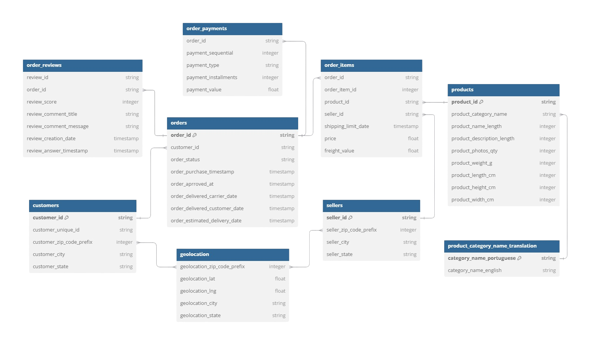

## Project Background

## Data Structure & Overview
Olist´s database structure as seen below consists of nine tables: **customers**, **orders**, **order_items**, **order_payments**, **order_reviews**, **products**, **sellers**, **geolocation**, and **product_category_name_translation**.

  
   
  <em>Figure 1: Entity Relationship Diagram showing table relationships in the dataset.</em>

### Data Description

- `customers`:  
This dataset includes information about the customer, such as their location and unique customer ID. The latter allows us to identify returning customers.  

- `orders`:  
This dataset offers insights into individual transactions, including the order status, timestamps for when an order was approved, when it was handed over to the carrier, when it was delivered to the customer, and the estimated delivery date provided at the time of purchase.

- `order_items`:  
This dataset includes information about the items purchased within each order, such as item price and freight value. This allows us to calculate total order and freight value.

- `order_payments`:  
This dataset includes information about the payment options for each order, such as method of payment, transaction value and number of installments chosen by the customer.

- `order_reviews`:  
This dataset includes data about customer reviews, including review score, comments and creation date. 

- `products`:  
Information about each product, such as categories, dimensions and weight. This dataset allows us to evaluate  

- `sellers`:  
This dataset contains location information about the sellers who processed orders placed on Olist.

- `geolocation`:  
Geographic data containing Brazilian zip codes, city, state and coordinates.

- `product_category_name_translation`:  
This dataset offers English translations for all product category names.

## Executive Summary
### Overview of Findings

## Insights Deep Dive

## Recommendations

## Sources 
Region mapping is based on [ISO](https://www.iso.org/obp/ui/#iso:code:3166:BR) 
