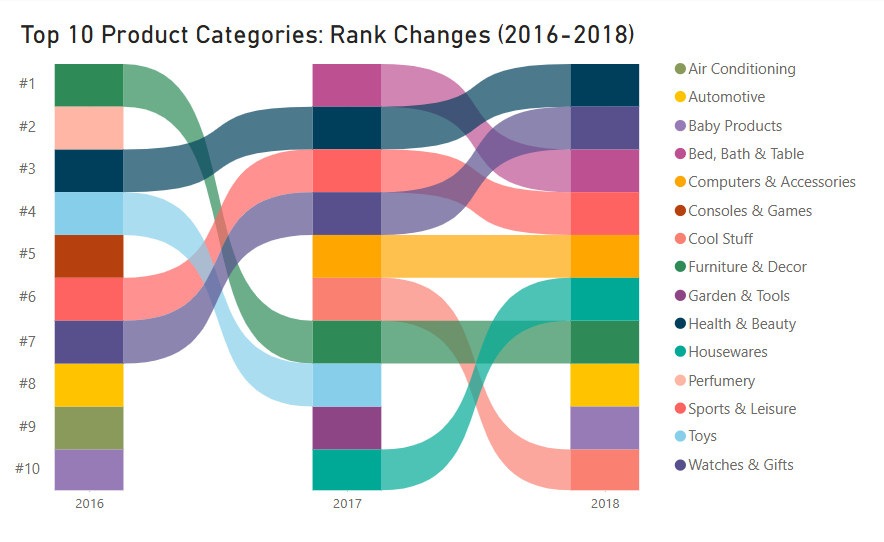
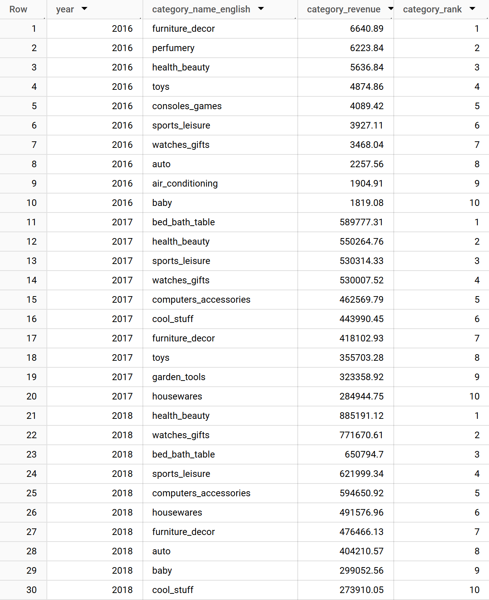
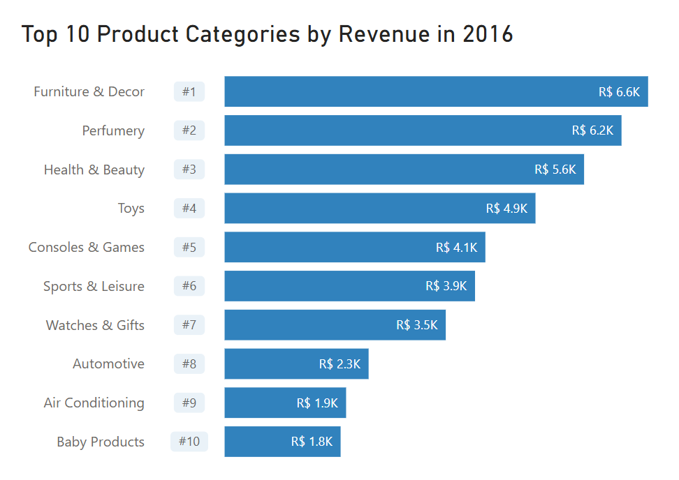
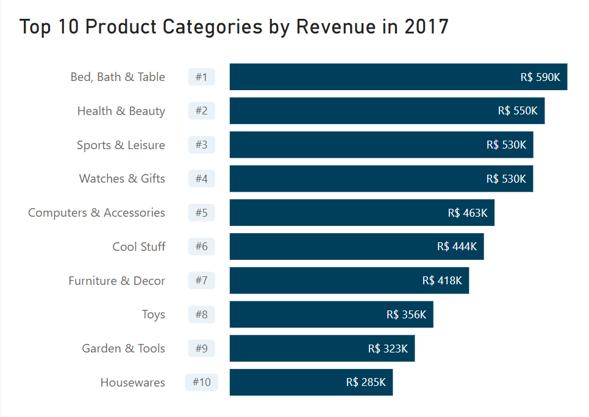
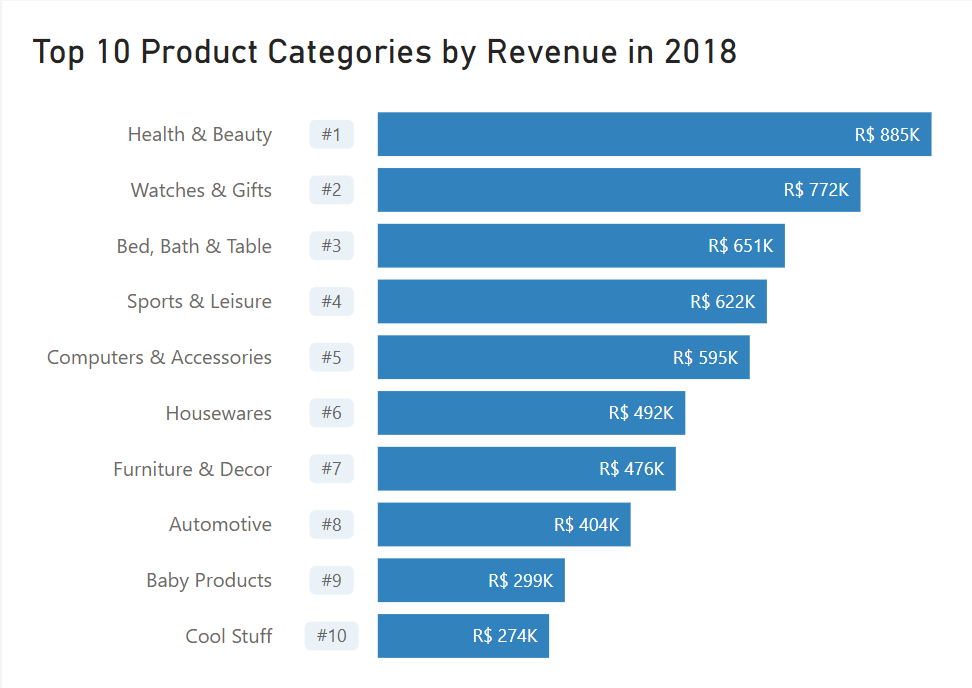

# Analysis of Top-Selling Product Categories per Year (2016–2018)

## 1. Problem Statement

What are the top-selling product categories for each year between 2016-2018? This analysis will help identify key product categories that contribute the most to revenue, providing insights for inventory planning and promotional strategies.

## 2. Datasets
- `orders_cleaned`
- `order_items`
- `products`
- `product_category_name_translation`

## 3. Methodology

### Subquery 1: Extracting Year and Calculating Total Orders per Category

In the first subquery, I aggregated the total number of orders for each product category, grouped by year. The key steps in this subquery include:

1. **Extracting Year**:

    Extracted the year from the `order_purchase_timestamp` in the `orders_cleaned` dataset.

2. **Connecting Datasets**:

    - Connected the `orders_cleaned` dataset with the `order_items` dataset to retrieve order details.
    
    - Linked the `order_items` dataset with the `products` dataset to obtain category names.
    
    - Mapped the `products` dataset to the `product_category_name_translation` dataset to translate product categories from Portuguese to English.

3. **Filtering for Delivered Orders**:

    Filtered the data to include only delivered orders.

4. **Aggregating Orders by Product Category**:

    Counted the total number of orders for each product category per year.

### Subquery 2: Ranking Top-Selling Categories

The results from Subquery 1 were used to rank product categories within each year based on the total number of orders. The key steps in this subquery include:

1. **Ranking**:

    Ranked product categories for each year in descending order of total orders.

2. **Filtering for Top 3 Categories**:

    Selected only the top three categories for each year.

### Main Query: Combining Results

The main query combines the results from the subqueries to produce a final list of the top-selling product categories for each year. The results are presented in descending order of total orders for better visibility of the highest-performing categories.

## 4. Results

The query returned a table with the top 10 product categories which generated the highest revenue for each year between 2016 and 2018 respectively. *(see Figure 1 in Section 5: Visualisations)*
Using this table, bar charts were created for each year *(see Figure 2.0-2.2 in Section 5: Visualisations)*, as well as the following ribbon chart visualising the product category rank changes and trends. 

  
   
  <em>Figure 3: Top 10 Product Categories: Rank Changes (2016-2018)</em>

The analysis of top-selling categories over the three-year period from 2016 to 2018 revealed several key trends, highlighting both consistent performers and shifting consumer preferences. It is important to note that the 2016 data covers only a partial year (September–December), and the 2018 data spans January–August. As a result, rank movements should be interpreted with caution. Nevertheless, the flow of ranks provides valuable insights into which categories demonstrated the strongest upward momentum and which ones struggled to maintain their top-10 status.  

Among the most notable findings was the consistent performance of certain categories that maintained their presence in the top 10 rankings throughout all three years. **Health & Beauty** emerged as a standout category, steadily climbing from **#3 in 2016 to #1 in 2018**, solidifying its position as the leading category. Similarly, **Watches & Gifts** demonstrated continuous improvement, rising from **#7 in 2016 to #2 in 2018**. **Sports & Leisure** also performed consistently well, peaking at **#3 in 2017** before settling at **#4 in 2018**. On the other hand, **Furniture & Decor**, which started as the **top category in 2016**, experienced a decline, dropping to **#7 in 2017 and remaining there in 2018**. These categories collectively demonstrated strong and sustained consumer demand over the period.  

In addition to the consistent performers, several emerging categories entered the rankings in 2017 and showed strong growth potential. **Bed, Bath & Table** made a remarkable debut at **#1 in 2017**, before settling at **#3 in 2018**, signaling a growing consumer interest in home-related products. Similarly, **Computers & Accessories** and **Housewares** gained traction, ranking at **#5 and #10 in 2017**, respectively, with **Housewares** improving to **#6 in 2018**. These trends suggest a shift in consumer purchasing behavior, with increasing demand for home and tech-focused products.  

However, not all categories maintained their momentum. Some experienced significant declines or dropped out of the top 10 entirely. **Perfumery**, which ranked **#2 in 2016**, disappeared from the rankings in 2017 and 2018. Similarly, **Toys** declined from **#4 in 2016 to #8 in 2017** before falling out of the top 10 in 2018. Other categories, such as **Consoles & Games** and **Air Conditioning**, were present in the top 10 in 2016 but failed to reappear in subsequent years. Additionally, **Cool Stuff**, which entered the rankings at **#6 in 2017**, dropped to **#10 in 2018**, indicating diminishing popularity. These declines suggest potential market saturation or evolving consumer priorities.  

The analysis also highlighted categories with fluctuating performance, reflecting seasonal demand or inconsistent growth. For example, **Automotive** ranked **#8 in 2016**, dropped out in 2017, and reappeared at **#8 in 2018**. Similarly, **Baby Products** followed a comparable pattern, ranking **#10 in 2016**, disappearing in 2017, and returning at **#9 in 2018**. **Garden & Tools** entered the rankings only in 2017 at **#9**, but did not appear in 2016 or 2018. These variations suggest niche or seasonal demand trends rather than sustained growth.  

In summary, the analysis underscores several key takeaways. **Health & Beauty** and **Watches & Gifts** demonstrated the strongest and most consistent growth over the three-year period. Meanwhile, **Bed, Bath & Table** and **Computers & Accessories** emerged as significant growth categories, reflecting shifting consumer priorities toward home and tech products. On the other hand, categories like **Perfumery** and **Toys** experienced notable declines, likely due to market saturation or changing trends. Finally, the fluctuating performance of certain categories, such as **Automotive** and **Baby Products**, highlights the influence of seasonality or niche demand on consumer purchasing behavior.  

Given these timestamp limitations, the results for 2016 and 2018 may not fully reflect trends for an entire year, and should be interpreted with this in mind.

Category names in the dataset were originally formatted as `furniture_decor`, `health_beauty`, `perfumery`, `bed_bath_table`, `sports_leisure`, and `computers_accessories`, which were translated into user-friendly terms for clarity.  

## 5. Visualisation

    
Figure 1: Top Selling Product Categories per Year (2016-2018)

    

 

    
Figure 2.0: Top 10 Product Categories by Revenue in 2016

    

 

    
Figure 2.1: Top 10 Product Categories by Revenue in 2017

    

 

    
Figure 2.2: Top 10 Product Categories by Revenue in 2018

    

