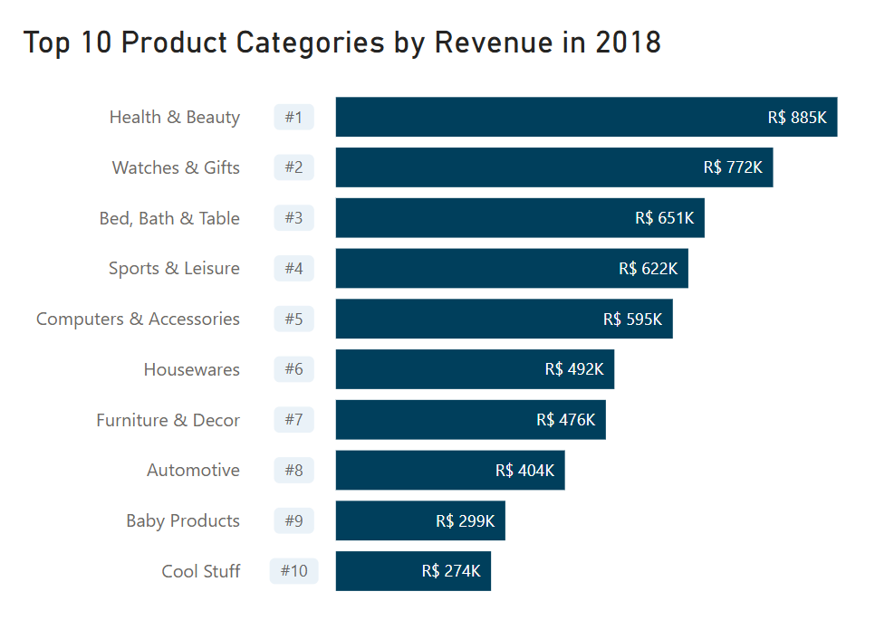

# Analysis of Top-Selling Product Categories per Year (2016–2018)

## 1. Problem Statement

What are the top-selling product categories for each year between 2016-2018? This analysis will help identify key product categories that contribute the most to revenue, providing insights for inventory planning and promotional strategies.

## 2. Datasets
- `orders_cleaned`
- `order_items`
- `products`
- `product_category_name_translation`

## 3. Methodology

### Subquery 1: Extracting Year and Calculating Total Orders per Category

In the first subquery, I aggregated the total number of orders for each product category, grouped by year. The key steps in this subquery include:

1. **Extracting Year**:

    Extracted the year from the `order_purchase_timestamp` in the `orders_cleaned` dataset.

2. **Connecting Datasets**:

    - Connected the `orders_cleaned` dataset with the `order_items` dataset to retrieve order details.
    
    - Linked the `order_items` dataset with the `products` dataset to obtain category names.
    
    - Mapped the `products` dataset to the `product_category_name_translation` dataset to translate product categories from Portuguese to English.

3. **Filtering for Delivered Orders**:

    Filtered the data to include only delivered orders.

4. **Aggregating Orders by Product Category**:

    Counted the total number of orders for each product category per year.

### Subquery 2: Ranking Top-Selling Categories

The results from Subquery 1 were used to rank product categories within each year based on the total number of orders. The key steps in this subquery include:

1. **Ranking**:

    Ranked product categories for each year in descending order of total orders.

2. **Filtering for Top 3 Categories**:

    Selected only the top three categories for each year.

### Main Query: Combining Results

The main query combines the results from the subqueries to produce a final list of the top-selling product categories for each year. The results are presented in descending order of total orders for better visibility of the highest-performing categories.

## 4. Results

The query returned a table with the top 10 product categories which generated the highest revenue for each year between 2016 and 2018 respectively. *(see Figure 1 in Section 5: Visualisations)*
Using this table, bar charts were created for each year *(see Figure 2.0-2.2 in Section 5: Visualisations)*, as well as the following ribbon chart visualising the product category rank changes and trends. 

  
   
  <em>Figure 3: Top 10 Product Categories: Rank Changes (2016-2018)</em>

The analysis revealed the following top-selling product categories:

- **2016**: The top-selling categories were **Furniture & Decor**, **Health & Beauty**, and **Perfumery**. However, it is important to note that the 2016 data only includes orders from mid-September to December, as the order timestamps for earlier months in the year were not included in the original dataset. This results in a significantly lower number of orders made in the top 3 categories in 2016 (133 orders) compared to 2017 (13,140 orders) and 2018 (16,272 orders). As such, direct comparisons between 2016 and the other years should be made with caution, as the 2016 data may not fully represent an entire year's sales performance.

- **2017**: The top-selling categories were **Bed, Bath & Table**, **Furniture & Decor**, and **Sports & Leisure**.

- **2018**: The top-selling categories were **Health & Beauty**, **Bed, Bath & Table**, and **Computers & Accessories**. It is also important to mention that the 2018 data cuts off in August, meaning that the analysis for this year does not account for the full year’s worth of sales. This limitation may also impact the interpretation of the 2018 results.

Given these timestamp limitations, the results for 2016 and 2018 may not fully reflect trends for an entire year, and should be interpreted with this in mind.

Category names in the dataset were originally formatted as `furniture_decor`, `health_beauty`, `perfumery`, `bed_bath_table`, `sports_leisure`, and `computers_accessories`, which were translated into user-friendly terms for clarity.

## 5. Visualisation

    
    
Figure 1: Top Selling Product Categories per Year (2016-2018)

    
    
Figure 2.0: Top 10 Product Categories by Revenue in 2016

<em>Figure 2.1: Top 10 Product Categories by Revenue in 2017
 

<em>Figure 2.2: Top 10 Product Categories by Revenue in 2018
 
